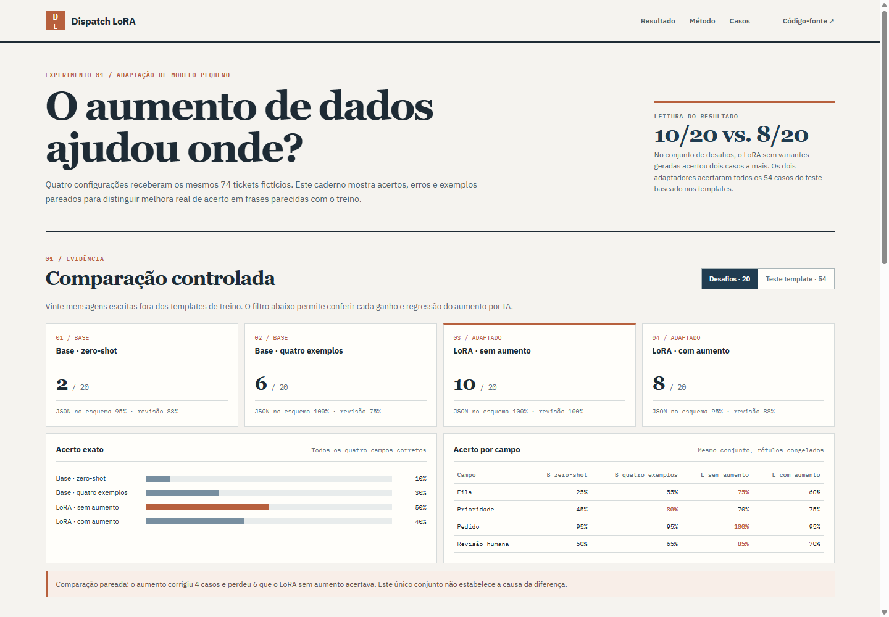

# Dispatch LoRA

A measured small-model adaptation for Portuguese service tickets. A fictional message becomes four fields: routing queue, priority, order reference and whether a person should review it. The project includes data generation, guarded AI paraphrases, two controlled LoRA runs and a frozen evaluation set.



## Explore the results

The [static result notebook](docs/index.html) compares all four arms on both evaluation sets and lets you inspect every prediction, including the four cases improved and six cases regressed by augmentation. Its data come only from the checked-in frozen artifacts; opening the page does not run a model or call an API.

From the repository root, run `python -m http.server 8181 --bind 127.0.0.1` and open `http://127.0.0.1:8181/docs/`. Regenerate the embedded case-level data with `python src/dashboard_data.py`; `python src/dashboard_data.py --check` verifies that the published page still matches the evaluation files.

## Dataset and controls

The 360 seed cases are generated locally from fictional companies and facts. A stable `family_id` is assigned before splitting: 257 train, 49 validation and 54 test. A separate 20-case challenge set uses phrasing outside the seed templates. Labels come from the seed facts, never from the paraphrasing model.

The local `qwen3:1.7b` model attempted 100 training-only paraphrases. Thirty-one passed exact anchor and order-reference checks; 69 were rejected (68 missing anchors, one changed order reference). Accepted examples preserve the parent label and record generator provenance and source hashes. The checked-in `data/train_augmented.jsonl` and `data/augmentation_rejections.jsonl` make that selection auditable. The augmented arm has 288 training examples, of which 10.8% are generated variants. Validation, test and challenge cases are never sent to the generator.

```bash
python src/audit.py
python -m unittest discover -s test -v
```

To regenerate the source dataset and attempt a new augmentation run, use `src/dataset.py`, `src/augment.py` and `src/prepare.py`. The generator is stochastic, so a new run may accept different paraphrases and will have different hashes. The frozen files in `data/` are the inputs for the measured comparison.

## Training

The tested recipe uses Qwen3.5-0.8B in bf16, rank-16 LoRA and completion-only supervised fine-tuning through Unsloth and TRL. Qwen3.5 uses a multimodal processor, so the SFT prompt and completion are stored as typed text blocks rather than plain chat strings. The 16-bit adapter path follows the current Unsloth guidance for this model family. Both arms use seed 714, 60 optimizer steps, effective batch size 8, the same learning rate and the same validation split. The only data difference is the 31 accepted training paraphrases. Adapter weights and checkpoints are excluded from Git; `outputs/*/run.json` records input hashes, elapsed time, GPU, allocated peak VRAM and package versions.

The experiment ran under Ubuntu 24.04 on WSL with Python 3.12, an NVIDIA RTX 4050 Laptop GPU (6 GB), `unsloth==2026.9.10`, `trl==0.24.0`, `transformers==5.5.0` and `torch==2.12.1+cu132`. A C compiler and Python development headers were needed for Triton. Install Unsloth in a virtual environment using the current [Unsloth Qwen3.5 instructions](https://unsloth.ai/docs/models/qwen3.5/fine-tune), then run:

```bash
python src/train.py --data data/sft_base --output outputs/lora-base --steps 60
python src/train.py --data data/sft_augmented --output outputs/lora-augmented --steps 60
```

## Evaluation

`data/eval_all.jsonl` freezes the 54 template-held-out test cases and 20 challenge cases. The four arms use the same instruction and cases: base zero-shot, base with one training example per queue, LoRA without augmentation, and LoRA with augmentation. The evaluator requires a complete JSON object with the four typed fields; malformed outputs count as errors. It reports JSON syntax validity and stricter field-schema validity separately. It records each input hash and checks that targets and input hashes match across all arms before comparing them.

```bash
python src/evaluate.py --cases data/eval_all.jsonl --out results/base-zero.jsonl
python src/evaluate.py --cases data/eval_all.jsonl --few-shot --out results/base-few.jsonl
python src/evaluate.py --cases data/eval_all.jsonl --adapter outputs/lora-base/adapter --out results/lora-base.jsonl
python src/evaluate.py --cases data/eval_all.jsonl --adapter outputs/lora-augmented/adapter --out results/lora-augmented.jsonl
python src/compare.py --base-zero results/base-zero.jsonl --base-few results/base-few.jsonl --lora-base results/lora-base.jsonl --lora-augmented results/lora-augmented.jsonl
```

The report includes JSON validity, schema validity, exact match, accuracy by field, recall on cases requiring human review, generation latency and paired wins/losses for the two LoRA arms. The first generation in a process may include compilation; the median is more representative of warm requests.

CI checks the dataset audit, Python tests and the checked-in four-arm comparison without a GPU. Training and live inference remain explicit local commands.

## Measured result

One local run used the frozen [`data/eval_all.jsonl`](data/eval_all.jsonl) for every arm. Full predictions are in `results/*.jsonl`; [`results/comparison.json`](results/comparison.json) checks the case IDs, labels and input hashes before producing the aggregate below. [`results/training.json`](results/training.json) records the training environment and hashes.

| Arm | Template test exact (54) | Challenge exact (20) | Challenge schema valid | Challenge queue | Challenge priority | Human-review recall (8) |
| --- | ---: | ---: | ---: | ---: | ---: | ---: |
| Base, zero-shot | 0 | 2 | 19 | 5 | 9 | 7 |
| Base, four-shot | 21 | 6 | 20 | 11 | 16 | 6 |
| LoRA, no augmentation | **54** | **10** | **20** | **15** | 14 | **8** |
| LoRA, AI augmentation | **54** | 8 | 19 | 12 | **15** | 7 |

Both LoRA arms saturated the template-style test. On the manually written challenge set, the augmented arm fixed four cases that the unaugmented arm missed, but lost six that it had correct: 8/20 versus 10/20 exact matches. It fixed the priority in `challenge-006` (a duplicate charge blocking today's close), but misrouted `challenge-011` (an API failure) and emitted the invalid combined queue `"billing, delivery"` in `challenge-019`. Fourteen of the 31 accepted paraphrases were technical cases, so acceptance was not class-balanced. That skew may matter, but this one run cannot establish a cause.

The unaugmented adapter is the better candidate in this measured setting. The generated data are still valuable as a documented negative experiment: preserving exact factual anchors did not supply enough useful variation for these challenge messages. Both runs used a single seed and a small fictional dataset; a two-case challenge difference is too small to claim that AI augmentation generally hurts. The template test is especially easy because its wording comes from the same generator as training. `challenge-020` also probes an instruction embedded in a ticket, and neither LoRA arm handled it correctly.

The two training runs took 349 s and 276 s. Their PyTorch peak allocated memory was 1.91 GiB and 1.85 GiB respectively; this excludes other GPU allocations. Median generation time was about 3.6-3.9 s per case on this laptop. No production accuracy or latency claim is made.

All source messages, company names and labels are fictional. No employer text, taxonomy or code is used. References: [Unsloth Qwen3.5](https://unsloth.ai/docs/models/qwen3.5/fine-tune), [TRL SFTTrainer](https://huggingface.co/docs/trl/sft_trainer).
